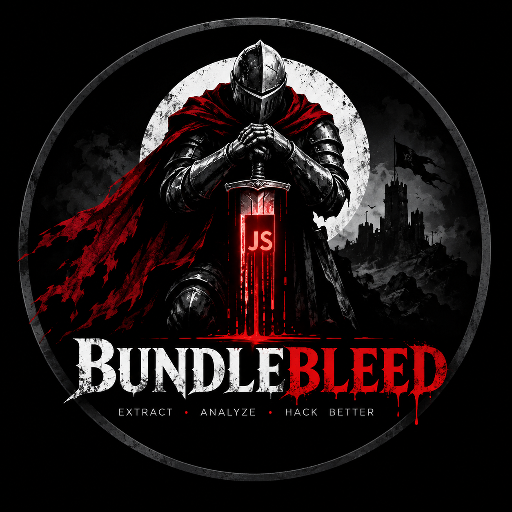

<p align="center">
  
</p>

# BundleBleed

**AI/LLM-assisted JavaScript reconnaissance and vulnerability triage for authorized bug bounty testing and pentesting.**

<p align="center">
  
  
  
  
</p>

BundleBleed collects a target's client-side JavaScript and server-rendered
pages, extracts candidate API endpoints, secrets, subdomains, parameters,
and DOM-XSS-shaped sink/source pairs, then turns those raw findings into
scored, explainable hypotheses — so you spend your limited engagement time
on the handful of things actually worth a manual look, not a flat dump of
every string that resembled a URL.

The full pipeline works with **zero LLM, zero API key, and zero third-party
account** — but plug in an LLM (Anthropic Claude, a self-hosted Ollama
model, or any OpenRouter model, including several free-tier ones — your
choice, never locked to one vendor) and BundleBleed uses it to classify
endpoints, draft a human-readable report from a hypothesis, and surface
attack chains connecting multiple findings, every claim tied back to a
citation from the actual scan evidence. See [AI-Powered Analysis](#ai-powered-analysis)
below.

## Why this one

Most JS-recon tools stop at "here are the endpoints/secrets I found."
BundleBleed's actual job is triage: every finding is scored on multiple
independent signals (is it only visible after login, was it actually
requested at runtime, does it match a known vulnerability shape, has it
shown up in a previous scan of the same target) before it's presented to
you — so a hunter with a two-day window can see the highest-signal leads
first instead of scrolling a wall of strings.

It's also built with a genuinely enforced safety model, not just a
disclaimer: a single `ScopeGuard` choke point that every outbound request
passes through, active scanning gated behind three independent
confirmations, and a verification layer that drafts a test for a human to
run but **never sends anything itself.**

## AI-Powered Analysis

BundleBleed's core extraction and hypothesis-scoring pipeline is deterministic
and needs no LLM at all — but every scan can optionally be handed to an AI
layer for the parts a human would otherwise spend the most time on:

- **Endpoint classification** — an LLM reviews extracted endpoints and
  flags the ones most likely to be interesting, with every claim required
  to cite a real evidence id from the scan or be rejected outright
- **Report drafting** — `ai report` turns a scored hypothesis and its
  already-redacted evidence into a clear, human-readable writeup, ready to
  adapt for a bug bounty submission
- **Attack-chain discovery** — `ai chains` looks across a scan's
  hypotheses for plausible multi-step chains a single finding wouldn't
  reveal on its own (e.g. an exposed parameter feeding a CORS-misconfigured
  endpoint)
- **Provider-agnostic** — run it against **Anthropic Claude**, a
  **self-hosted Ollama** model (fully private, zero data leaves your
  machine), or **OpenRouter** (access to many models, several genuinely
  free) — swap providers with one flag, never locked to a vendor

The LLM is a triage assistant, never an authority: it cannot decide scope,
send a request, or close a finding, and a hallucinated citation is a hard
failure rather than a warning. See [Safety model](#safety-model) for the
full list of guarantees this holds to.

## Features

**Collection & scope**
- Scope from `-t domain.com`, `-tL scope.txt` (many domains, wildcards,
  exclusions), or a full `scope.yaml` (rate limiting, authorization
  attestation, sessions)
- Passive collection via `gau`/`waybackurls`; active crawling via `katana`,
  gated behind an explicit config flag *and* CLI flag *and* a signed
  authorization attestation — all three, every time
- `--seed-url`/`--seed-url-file` to inject known URLs directly — essential
  for a freshly provisioned or JS-heavy SPA target with no archive history
- Every single URL, from any source, is re-validated through `ScopeGuard`
  before it's ever used, with an audit-log row per decision

**Extraction**
- Candidate API endpoints: `/api/...` paths, Express/OpenAPI route params,
  `fetch()`/`axios()`/`$.ajax()`/`$.get()`/`$.post()`, bare `axios(...)`
  and config-object shorthand, raw `XMLHttpRequest.open()`,
  `navigator.sendBeacon()`, GraphQL, WebSocket — plus plain server-rendered
  `<a href>` links and `<form action>` targets that JS-only patterns miss
- 57 secret patterns: cloud provider keys (AWS/GCP/Azure/Cloudflare/
  DigitalOcean), payment/messaging tokens (Stripe, Slack, Twilio, SendGrid,
  Discord, Square, Shopify, PayPal/Braintree), AI/LLM provider keys
  (OpenAI, Anthropic, Cohere, Hugging Face), modern SaaS platforms
  (Supabase, Clerk, PlanetScale, PostHog, Sentry, Notion, Algolia,
  GitLab/GitHub fine-grained PATs), private key blocks, JWTs, generic
  Bearer tokens — always redacted (type + preview + partial hash only,
  never plaintext); new patterns curated from TruffleHog's and Gitleaks'
  public detector rulesets, tuned against their documented false-positive
  cases (e.g. never flagging PostHog's or Algolia's intentionally-public
  keys)
- Higher-severity shapes chosen from real disclosed HackerOne/Bugcrowd
  reports and named bug hunters' published methodologies: SSRF-shaped
  parameters, prototype-pollution-prone deep-merge calls, JWT `alg:none`
  (every JWT's header is decoded to check), CORS misconfiguration
  (`Allow-Origin: *` + `Allow-Credentials: true`), open/misconfigured
  Firebase-style databases, third-party script/supply-chain surface,
  GraphQL introspection left enabled, dangling cloud-storage-bucket
  references (subdomain/bucket-takeover candidates), hardcoded cloud
  metadata-endpoint references (SSRF targets), exposed Swagger/OpenAPI
  spec paths, exposed `.git`/`.env`/`.svn` path references, internal/
  staging hostname disclosure, `postMessage` listeners with no origin
  check, WebSocket connections with no visible auth (Cross-Site WebSocket
  Hijacking candidates), mass-assignment-shaped object literals (a
  privileged field like `role`/`isAdmin`/`ownerId` assigned near a
  PATCH/PUT/POST call — ARIA `role="button"`-style attributes are
  filtered out explicitly), and known-vulnerable third-party library
  versions fingerprinted from their own preserved banner comments
  (Retire.js-style, matched against a small curated list of real CVEs —
  jQuery, Lodash, Moment.js, AngularJS, Handlebars, Bootstrap, jQuery UI)
- In-domain subdomains, security-interesting parameters (from both JS
  declarations and URL query strings), DOM-XSS sink/source co-occurrence
- Source maps are followed and, when a map embeds `sourcesContent`, the
  original unminified source is recovered and analyzed too — at zero
  additional network cost, since the map was already being fetched

**Hypothesis engine**
- Flat findings become scored `Hypothesis` objects only when they match a
  known vulnerability shape — an ordinary finding with no signal isn't
  hypothesis-worthy on its own
- Multi-factor confidence: static pattern match, JS-body-only visibility,
  rule match, authenticated-context, historical cross-scan match,
  runtime-confirmed evidence, and capped AI confidence, combined into one
  score and risk tier
- Optional authenticated crawling (pre-obtained cookie — no login
  automation) and headless-browser runtime capture (every request
  individually scope-checked before it's allowed to fire) feed real
  signal into the same scoring
- **Authenticated runtime capture**: when a session is given alongside
  `--runtime-capture`, every page is *also* rendered in the headless
  browser with that session's cookie attached — so client-side routing
  gated on auth state (an admin panel that only lazy-loads its JS chunk
  for a logged-in user, for example) actually renders, and whatever chunk
  it loads gets pulled in and analyzed too. A JS chunk that only shows up
  in the authenticated pass is flagged the same way as any other
  auth-only finding — untouched-by-unauthenticated-scanners surface is
  exactly where a missing RBAC check tends to live

**Verification — always human-fired**
- For IDOR hypotheses with a concrete numeric id, drafts exactly one test
  variant as `.http`/`curl` artifacts — a cookie, if any, is always a
  placeholder, never a real value
- **This tool never sends the drafted request itself.** A human runs it and
  records the outcome — the only way a hypothesis's status ever changes

**AI / LLM layer (fully optional)**
- `--ai` classifies endpoints with a versioned prompt; every claim must
  cite an id that was actually in the prompt, or it's a hard failure, not
  a warning
- `ai report` drafts a report from a hypothesis's own already-redacted
  evidence; a keyword check flags any step that reads like an
  exploitation instruction despite the prompt forbidding it
- `ai chains` suggests connections between two or more hypotheses from the
  same scan, with the same citation-validation discipline
- Works against Anthropic, a self-hosted Ollama model, or OpenRouter
  (several genuinely free-tier models) — pick one, or use none of it

**Reporting**
- JSON, Markdown, and a self-contained HTML dashboard (no CDN, works via
  `file://`, sortable/filterable tables, light/dark aware)
- Plain-text wordlists (`urls`/`endpoints`/`parameters`/`subdomains`/
  `third-party-hosts`) for piping straight into `ffuf`, `httpx`, Burp
  Intruder, `nuclei`
- Optional scan history + diffing across runs (flags an endpoint moving
  from authenticated-only to public, among other regressions), with
  webhook alerts that stay silent unless something actually changed

## Safety model

These are structural constraints, not a policy document:

| Guarantee | How it's enforced |
|---|---|
| No exploitation, ever | No credential submission, no fuzzing, no brute-forcing, no writes to a target — not a configuration option, not present in the code |
| Every outbound request is scope-checked | `ScopeGuard` is the single choke point; every collector, downloader, and browser request routes through it, with an audit-log row per decision |
| Passive by default | Active scanning requires an explicit config flag **and** CLI flag **and** a signed attestation in `scope.yaml` — all three |
| The AI has no authority | It classifies and drafts; it never decides scope, never sends a request, never confirms or closes a finding. Every claim must cite real evidence — a hallucinated citation is a hard failure |
| Evidence is data, never instruction | Content scanned from a target is attacker-controlled; anything in it that looks like an instruction is reported as a finding, never obeyed |
| A human approves everything outbound | Verification requests, reports, and alerts all draft; only a human ever sends |
| Secrets are redacted at ingest | Type + preview + partial hash only — a live credential never touches a log, report, or evidence file in plaintext |

## Installation

Requires Python 3.12+ and [`uv`](https://docs.astral.sh/uv/).

```bash
git clone <this-repo>
cd bundlebleed
uv sync
```

Optional, for headless-browser runtime capture:

```bash
uv sync --extra runtime
uv run playwright install chromium
```

## Quick start

```bash
# Single domain
uv run bundlebleed scan -t example.com -o results/

# Multiple domains, comma-separated
uv run bundlebleed scan -t example.com,api.example.com -o results/

# Multiple domains from a file (wildcards with '*.', exclusions with '!')
uv run bundlebleed scan -tL examples/scope-multi-domain.txt -o results/

# Full control via scope.yaml (rate limiting, authorization attestation, sessions)
uv run bundlebleed scan --config scope.yaml -o results/

# Fresh/JS-heavy target with no gau/waybackurls archive history
uv run bundlebleed scan -t example.com --seed-url https://example.com/ -o results/

# Authenticated scan -- a pre-obtained session cookie (never a login this tool performs)
uv run bundlebleed scan -t example.com --session "mysession:cookie_string_here" -o results/

# ...or from a cookie file (raw header, JSON, or Netscape cookies.txt export)
uv run bundlebleed scan -t example.com --cookie-file cookies.txt -o results/
```

Every command and subcommand supports `-h`/`--help`
(`bundlebleed -h`, `bundlebleed scan -h`, `bundlebleed ai report -h`, ...) —
`bundlebleed scan -h` in particular includes worked examples for every
scenario above.

Output lands in the directory you pass to `-o`:

```
results/
├── scan-result.json       # full structured result
├── scan-result.md         # human-readable summary
├── scan-result.html       # self-contained dashboard (open in a browser)
├── wordlists/              # plain .txt lists for other tools
├── evidence/<id>/          # one folder per hypothesis
└── audit_log.jsonl         # every ScopeGuard decision
```

### Optional AI-assisted analysis

```bash
# Anthropic
export ANTHROPIC_API_KEY=sk-ant-...
uv run bundlebleed scan -t example.com -o results/ --ai --ai-model claude-opus-5

# Self-hosted Ollama
uv run bundlebleed scan -t example.com -o results/ \
  --ai --ai-provider ollama --ai-model llama3 --ai-host http://localhost:11434

# OpenRouter (free account, several genuinely free-tier models)
export OPENROUTER_API_KEY=sk-or-...
uv run bundlebleed scan -t example.com -o results/ \
  --ai --ai-provider openrouter --ai-model meta-llama/llama-3.1-8b-instruct:free

# Draft a report from a hypothesis already in the evidence store
uv run bundlebleed ai report <hypothesis-id> --model claude-opus-5 -o results/

# Suggest connections between a scan's hypotheses
uv run bundlebleed ai chains -o results/ --model claude-opus-5
```

### Manual verification workflow

```bash
# Requires --active + active_scan_enabled (app config) + scope.yaml attestation
uv run bundlebleed scan --config scope.yaml -o results/ --active --draft-verification

# ...then, after you run the drafted script yourself and capture both responses:
uv run bundlebleed verify diff --baseline resp-baseline.json --test resp-test.json
uv run bundlebleed verify record <hypothesis-id> --outcome confirmed -o results/
```

## Command reference

Every command below also has full built-in help: `bundlebleed <command> -h`
(and `bundlebleed <group> <command> -h` for `scope`/`verify`/`ai` subcommands).

### `bundlebleed scan` — collect, extract, score, report

```bash
uv run bundlebleed scan [OPTIONS]
```

| Flag | Purpose |
|---|---|
| `-t, --target` | One domain, or several comma-separated (`example.com,api.example.com`) |
| `-tL, --target-list` | A scope file, one domain per line (`*.` wildcard, `!` to exclude) |
| `--config` | Full `scope.yaml` instead of `-t`/`-tL` — rate limits, authorization attestation, sessions |
| `--seed-url` | Inject a known URL directly (repeatable) — for a fresh/JS-heavy target with no archive history |
| `--seed-url-file` | Load seed URLs from a file, one per line |
| `-o, --output` | Output directory (default `./results`) |
| `--active / --no-active` | Enable active collectors (e.g. `katana`) — also needs app-config `active_scan_enabled=true` **and** a `scope.yaml` attestation |
| `--app-config` | App-level `config.yaml` (`active_scan_enabled`, etc.) |
| `--download / --no-download` | Fetch JS/page bodies for deep extraction (default on); still passive GETs only |
| `--concurrency` | Max concurrent JS file downloads (default `5`) |
| `--ai / --no-ai` | Classify collected endpoints with an LLM (off by default) |
| `--ai-model` | Exact model id — required with `--ai`, never defaulted |
| `--ai-provider` | `anthropic` (default), `ollama`, or `openrouter` |
| `--ai-host` | Ollama server URL — required with `--ai-provider ollama` |
| `--ai-batch-size` | Endpoints per LLM call (default `20`) |
| `--ai-dry-run` | Show what would be sent to the model without calling it |
| `--session` | Authenticated session as `name:cookie_string` (repeatable) — also feeds an authenticated pass of `--runtime-capture`, if given |
| `--cookie-file` | Load a session's cookies from a file (raw header, JSON, or Netscape format) |
| `--draft-verification` | Draft (never send) a baseline/test request pair for IDOR-shaped hypotheses; same 3-gate authorization as `--active` |
| `--history-dir` | Save + diff this scan against the most recent prior scan of the same target |
| `--webhook` | Post a change summary here when `--history-dir` finds something changed |
| `--runtime-capture` | Render pages in headless Chromium and record every real request made; with `--session`/`--cookie-file`, also re-renders each page authenticated so auth-gated client-side routing (and the JS chunk behind it) actually loads; same 3-gate authorization as `--active`; needs `uv sync --extra runtime` |
| `--runtime-max-pages` | Cap how many pages get rendered (default `10`) |
| `--runtime-timeout` | Per-page hard timeout in seconds (default `15.0`) |

See [Quick start](#quick-start) above for worked single/multi-domain/config
examples, and [AI-Powered Analysis](#ai-powered-analysis) for `--ai` examples
against each provider.

### `bundlebleed scope check` — will a URL be allowed?

```bash
# Check one URL against a -t/-tL scope, without running a scan
uv run bundlebleed scope check "https://api.example.com/v1/users" -t example.com

# ...or against a full scope.yaml
uv run bundlebleed scope check "https://admin.example.com/" --config scope.yaml
```

Prints `ALLOW: <reason>` or `DENY: <reason>` and exits non-zero on deny —
useful for sanity-checking a scope file before a real scan.

### `bundlebleed scope list` — print the resolved scope

```bash
uv run bundlebleed scope list -t example.com,api.example.com
uv run bundlebleed scope list --config scope.yaml
```

Prints the resolved in-scope entries, exclusions, excluded paths, and the
effective rate-limit settings — what the scan will actually enforce.

### `bundlebleed verify diff` — compare two captured responses

```bash
uv run bundlebleed verify diff --baseline resp-baseline.json --test resp-test.json
```

Takes two JSON files you produced yourself (`{"status_code": int, "body": str}`)
after running a drafted verification request. Never sends anything — pure
local comparison (status match, body-length delta, JSON keys added/removed,
sensitive fields appearing in the test response).

### `bundlebleed verify record` — log what you found

```bash
uv run bundlebleed verify record <hypothesis-id> --outcome confirmed -o results/
uv run bundlebleed verify record <hypothesis-id> --outcome rejected --note "returned 403" -o results/
```

`--outcome` is one of `confirmed`, `rejected`, `inconclusive`. This is the
**only** way a hypothesis's status ever changes — always a human decision.

### `bundlebleed ai report` — draft a report from a hypothesis

```bash
uv run bundlebleed ai report <hypothesis-id> --model claude-opus-5 -o results/
uv run bundlebleed ai report <hypothesis-id> --model llama3 --provider ollama --host http://localhost:11434 -o results/
uv run bundlebleed ai report <hypothesis-id> --model meta-llama/llama-3.1-8b-instruct:free --provider openrouter -o results/
```

Writes `report-draft.md` from the hypothesis's own already-redacted
evidence. Never submitted anywhere by this tool.

### `bundlebleed ai chains` — suggest connections between findings

```bash
uv run bundlebleed ai chains -o results/ --model claude-opus-5
uv run bundlebleed ai chains -o results/ --model llama3 --provider ollama --host http://localhost:11434
```

Reads an existing scan's `scan-result.json` and writes `attack-chains.md`.
Pure analysis — never a claim that a chain was tested or works.

## What it deliberately doesn't do

- Send a verification or exploitation request itself — always human-fired,
  by design
- Automate a login flow — only pre-obtained session cookies are supported
- Decide scope, submit findings, or act on an AI suggestion autonomously
- Fuzz, brute-force, or write (POST/PUT/DELETE) to a target under any flag

## Development

```bash
uv sync
uv run ruff check .
uv run ruff format --check .
uv run mypy --strict bundlebleed
uv run pytest
```

No live network calls are made anywhere in the test suite — every HTTP
call is mocked, every external tool invocation is faked, and
runtime-instrumentation tests drive a real headless browser against inert
`data:` URLs only.

## Legal

This tool is intended for **authorized security testing only.** Always
obtain written permission before testing any target — enroll in the
program's bug bounty platform, or get explicit written authorization
outside one. `ScopeGuard` enforces whatever scope you configure; it cannot
know if that configuration itself is authorized. Unauthorized access to
computer systems is illegal. The authors are not responsible for misuse of
this tool.

## License

MIT — see [LICENSE](LICENSE).
