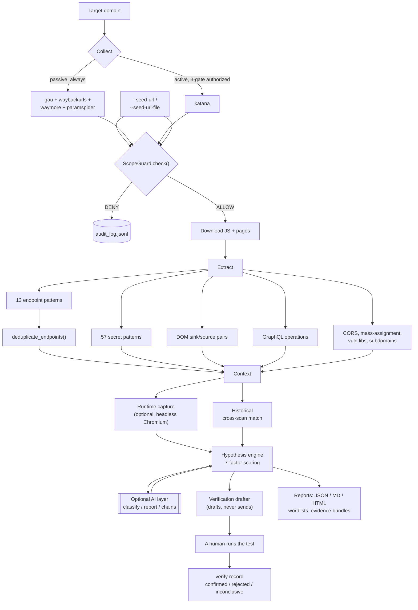
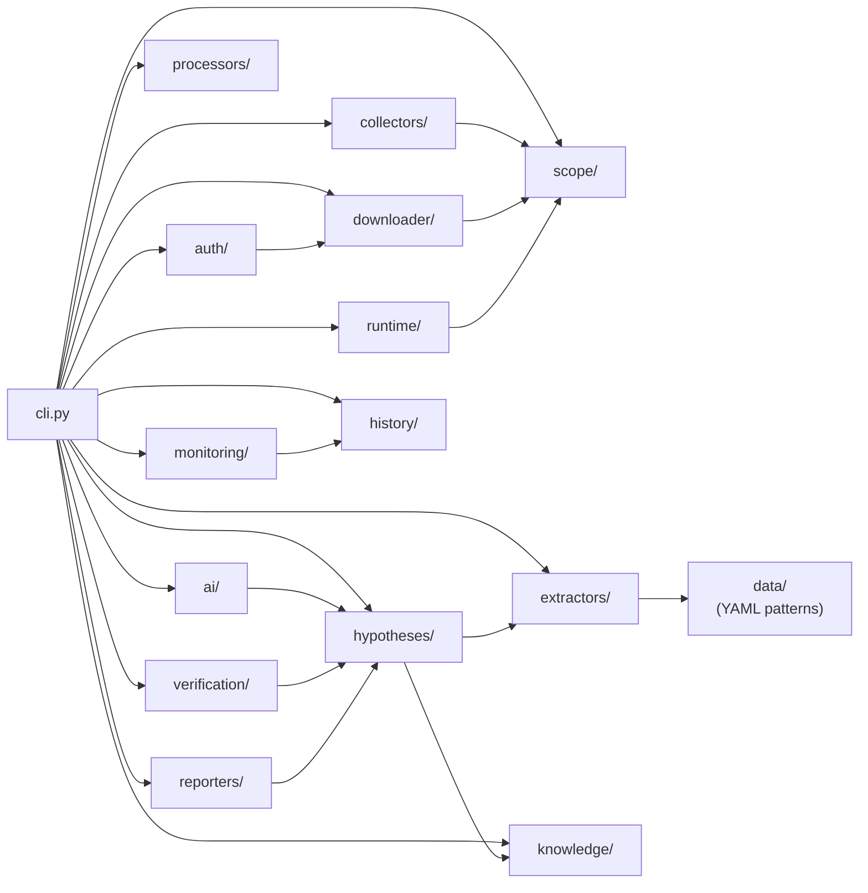
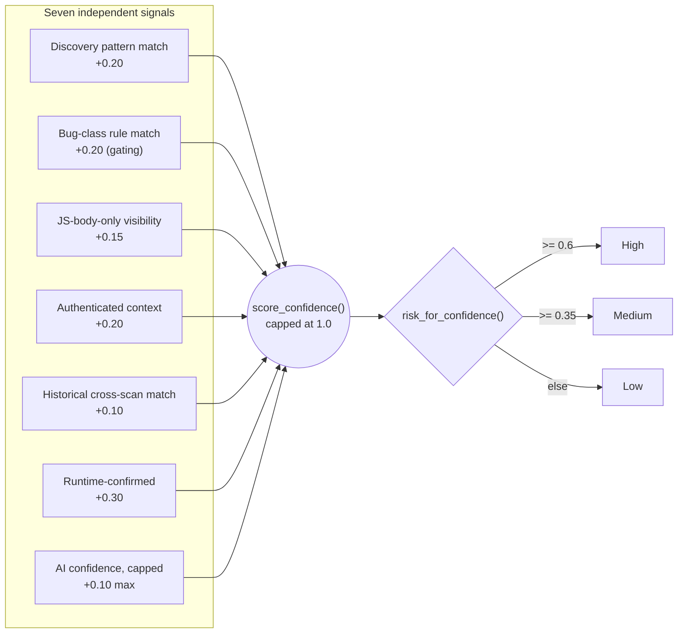

# Architecture Diagrams

Visual companions to [How It Works](02-how-it-works.md) and
[Architecture & Extending](04-architecture.md) — read those for the prose
explanation of anything below. These render as actual diagrams on GitHub
(Mermaid is supported natively in Markdown); if you're reading this in a
plain text editor instead, the prose docs linked above cover the same
ground without needing a renderer.

## 1. The full scan pipeline

Every stage after COLLECT runs on data already downloaded and
scope-checked — nothing downstream makes its own network request.

**Read it as:** four passive archive sources feed in freely; the one active
crawler (`katana`) only joins if all three authorization gates hold. Every
single URL from any source — passive, active, or a `--seed-url` — passes
through the same `ScopeGuard.check()` before anything downloads it. From
there, extraction fans out into several independent detectors, endpoints
get deduplicated across files, and everything converges on one scoring
engine before an optional AI layer and a strictly human-gated verification
step.

## 2. Module architecture

Which package depends on which. `cli.py` is the only thing that talks to
all of them; packages don't reach into each other except where shown.

**Read it as:** `scope/` is the one package almost everything that touches
the network depends on — `collectors/`, `downloader/`, and `runtime/` all
route through `ScopeGuard` rather than calling out directly.
`hypotheses/` is the hub on the other side: it consumes `extractors/`
output and `knowledge/`'s cross-referencing, and everything downstream
(`ai/`, `verification/`, `reporters/`) depends on *it*, not on the raw
extractors. Adding a new pattern only touches `extractors/` + `data/`;
adding a new bug class touches `hypotheses/engine.py` too — see
[Architecture § Adding a detection pattern](04-architecture.md#adding-a-detection-pattern--no-python-required).

## 3. The scoring engine

How seven independent signals become one confidence score and a risk tier.

**Read it as:** "Bug-class rule match" is doubly important — it's both a
scoring signal *and* the literal gate (`if not rule_match: continue` in
`hypotheses/engine.py`) that decides whether an endpoint becomes a
hypothesis at all. The other six only ever adjust the score of something
that already cleared that gate. Full weight table and exact thresholds:
[How It Works § The hypothesis / scoring engine](02-how-it-works.md#the-hypothesis--scoring-engine).
